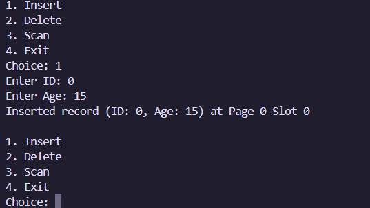
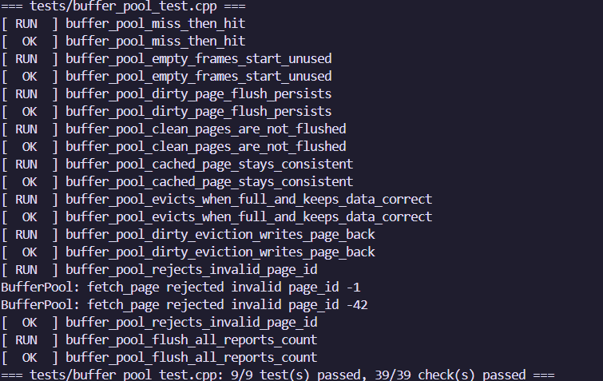
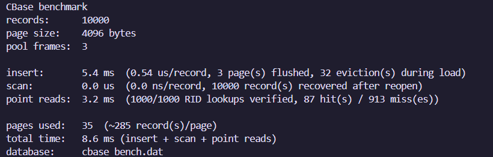
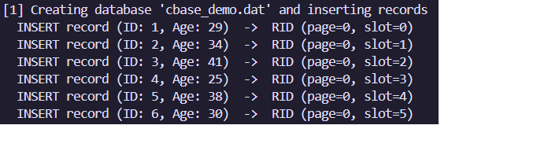

# CBase

### A lightweight database storage engine built from scratch in C++

CBase is a small persistent storage engine designed to explore how database systems organize records on disk, cache pages in memory, and translate record operations into low-level storage operations.

Rather than using an existing database library, CBase implements the core storage layer itself:

```text
Application / CLI
       │
       ▼
   HeapFile
       │
       ▼
   BufferPool
       │
       ▼
  DiskManager
       │
       ▼
  Binary Database File
```

The project focuses on understanding **pages, slotted-page storage, record addressing, buffer pools, eviction, persistence, and testing**.

---

## Demo

### Interactive Showcase

A minimal technical showcase is included in [`website/`](https://piyushsakhuja.github.io/cbase/).

It visualizes:

* the storage architecture
* 4 KB page layout
* buffer pool behavior
* record lifecycle
* engineering bugs and fixes
* test results
* benchmark results

**Run locally:**

```powershell
cd website
python -m http.server 8000
```

Then open:

```text
http://localhost:8000
```

> The website is a presentation layer only. It does not execute the C++ storage engine in the browser.

### Screenshots








### Video





---

# Engineering Highlights

CBase wasn't just implemented and left untouched.

During development, three important correctness problems were reproduced and fixed.

### 01 — Silent Data Loss

Multiple inserts in a single session could repeatedly reinitialize the same page because the implementation used the **on-disk page count** to determine whether a page was new, while dirty pages had not yet been flushed.

```text
Insert
  ↓
Dirty page in memory
  ↓
On-disk page count unchanged
  ↓
Page incorrectly considered "new"
  ↓
Previous records overwritten
```

**Fix:** Added initialized-page tracking and regression coverage.

---

### 02 — Buffer Pool Crash

The original buffer pool had three frames but no eviction policy.

Requesting a fourth distinct page caused the program to terminate.

```text
Frame 0 → Page A
Frame 1 → Page B
Frame 2 → Page C

Request Page D
      ↓
No free frame
      ↓
Program termination
```

**Fix:** Added round-robin eviction with dirty-page write-back.

---

### 03 — CLI Infinite Loop

Invalid input could leave `std::cin` in a failed state, causing the menu to print indefinitely.

**Fix:** Added input validation and fail-state recovery.

---

Each of these issues was reproduced before being fixed and covered by regression tests afterward.

---

# Features

* Persistent binary disk storage
* Fixed-size **4 KB pages**
* Slotted-page record organization
* Buffer pool caching
* Dirty-page tracking
* Round-robin page eviction
* Dirty-page write-back
* RID-based record addressing
* Record insertion
* Record retrieval by RID
* Logical deletion
* Slot reuse
* Sequential scanning
* Input validation
* Unit and integration tests
* Sanitizer validation
* Guided demo
* Benchmark program

---

# Architecture

CBase is organized into four main storage layers:

```text
┌─────────────────────────┐
│          CLI            │
└────────────┬────────────┘
             │
             ▼
┌─────────────────────────┐
│       HeapFile          │
│  Record management      │
└────────────┬────────────┘
             │
             ▼
┌─────────────────────────┐
│      BufferPool         │
│   Memory page cache     │
└────────────┬────────────┘
             │
             ▼
┌─────────────────────────┐
│      DiskManager        │
│       Disk I/O          │
└────────────┬────────────┘
             │
             ▼
┌─────────────────────────┐
│    Binary database      │
│          file           │
└─────────────────────────┘
```

### DiskManager

Responsible for low-level page I/O.

* Reads fixed-size pages
* Writes fixed-size pages
* Creates and maintains the database file
* Maps page IDs to file offsets
* Uses 64-bit offset arithmetic
* Reports I/O failures

The page offset is:

```text
offset = page_id × PAGE_SIZE
```

---

### Page

Represents an in-memory 4 KB page frame.

```text
PAGE_SIZE = 4096 bytes
```

Each page contains:

* raw byte storage
* page ID
* dirty state

A page ID of `-1` represents an empty frame.

---

### BufferPool

Keeps frequently accessed pages in memory.

The current implementation uses:

```text
3 buffer frames
```

It tracks:

* cache hits
* cache misses
* evictions
* dirty-page write-backs

The eviction policy is intentionally simple:

> **Round-robin replacement**

When all frames are occupied, the next frame is reclaimed. If its page is dirty, it is written back to disk first.

This is a deliberate v1 trade-off rather than an attempt to implement a production-quality LRU/clock replacer.

---

### HeapFile

Manages records stored inside pages.

It supports:

```text
INSERT
READ
DELETE
SCAN
```

The record manager works with:

* PageHeader
* Slot Directory
* free-space tracking
* RIDs

---

# Inside a 4 KB Page

CBase uses a slotted-page layout.

```text
Offset 0
┌────────────────────────────────┐
│ Page Header — 6 bytes          │
├────────────────────────────────┤
│ Slot 0 — 6 bytes               │
│ Slot 1 — 6 bytes               │
│ Slot 2 — 6 bytes               │
│ ...                            │
├────────────────────────────────┤
│                                │
│          Free Space            │
│                                │
├────────────────────────────────┤
│ Record — 8 bytes               │
│ Record — 8 bytes               │
│ Record — 8 bytes               │
└────────────────────────────────┘
Offset 4095
```

The slot directory grows from the beginning of the page while records grow upward from the end.

When the two regions meet, the page is full.

With the current fixed-size record format:

```text
Page size       = 4096 bytes
Page header     = 6 bytes
Slot size       = 6 bytes
Record size     = 8 bytes
```

A full page holds:

```text
(4096 − 6) / (8 + 6) = 292 records
```

---

# Record IDs

Every record is identified using a:

```text
(page_id, slot_id)
```

This is the record's **RID (Record Identifier)**.

For example:

```text
RID
┌──────────────┐
│ page = 3     │
│ slot = 17    │
└──────────────┘
```

The RID provides a stable way to locate a record within the storage engine.

---

# Logical Deletion

Records are logically deleted rather than physically removed.

Conceptually:

```cpp
slot.is_used = 0;
```

This avoids shifting records around inside the page.

After deletion:

```text
Record
  ↓
slot marked unused
  ↓
RID no longer resolves
  ↓
slot can later be reused
```

The record bytes themselves are not reclaimed in v1 because page compaction has not been implemented.

---

# Persistence

CBase uses a binary file as persistent storage.

The basic lifecycle is:

```text
INSERT
   ↓
Page modified in memory
   ↓
Page marked dirty
   ↓
Flush / eviction
   ↓
Binary file
```

When the database is reopened:

```text
Binary file
   ↓
DiskManager
   ↓
BufferPool
   ↓
Page
   ↓
Record
```

Data survives normal program restarts.

### Durability caveat

CBase does not currently implement `fsync` or a write-ahead log (WAL).

A successful flush therefore means that the bytes have been handed to the operating system's file cache; it does not guarantee that the data has reached physical storage before a sudden machine or process failure.

This is an intentional limitation of the educational v1 implementation.

---

# On-Disk Format

CBase currently writes its page structures directly as binary data.

The implementation uses compile-time checks for the expected structure sizes:

```text
PageHeader = 6 bytes
Slot       = 6 bytes
Record     = 8 bytes
```

This keeps the implementation simple and makes the page format easy to inspect.

The trade-off is that the database file assumes compatible:

* structure layout
* alignment
* endianness

The current format therefore assumes little-endian systems and compatible C++ structure layouts.

A future version could introduce explicit serialization for a portable file format.

---

# Building

You do not need a frontend framework or external database library.

### Simple build with g++

From the project root:

```bash
g++ -std=c++17 -Wall -Wextra -Wpedantic \
main.cpp \
storage/buffer_pool.cpp \
storage/disk_manager.cpp \
storage/heap_file.cpp \
storage/page.cpp \
-o cbase
```

On Windows:

```powershell
g++ -std=c++17 -Wall -Wextra -Wpedantic main.cpp storage/buffer_pool.cpp storage/disk_manager.cpp storage/heap_file.cpp storage/page.cpp -o cbase.exe
```

Run:

```powershell
.\cbase.exe
```

---

# CLI

The current CLI intentionally stays small:

```text
1. Insert
2. Delete
3. Scan
4. Exit
```

The interface supports:

* record insertion
* logical deletion
* sequential scanning
* input validation
* invalid RID handling
* failure reporting

---

# Testing

CBase includes unit and integration tests.

```text
tests/
├── test_framework.h
├── page_test.cpp
├── disk_manager_test.cpp
├── buffer_pool_test.cpp
├── heap_file_test.cpp
└── integration_test.cpp
```

### Test coverage

| Suite       |  Tests | Focus                         |
| ----------- | -----: | ----------------------------- |
| Page        |      5 | Page storage and state        |
| DiskManager |      8 | File lifecycle and I/O        |
| BufferPool  |      9 | Caching, eviction, write-back |
| HeapFile    |     14 | Record lifecycle and pages    |
| Integration |      2 | Full database lifecycle       |
| **Total**   | **38** |                               |

The test suite contains **4,811 checks**.

Coverage includes:

* record insertion
* record retrieval
* logical deletion
* slot reuse
* full pages
* multi-page databases
* persistence across restart
* buffer-pool eviction
* dirty-page write-back
* invalid RIDs
* corrupt page handling
* regression tests for the original data-loss bug

---

# Running Tests Without Make or CMake

Each test file contains its own `main()`, so the suites are compiled separately.

### Page

```powershell
g++ -std=c++17 -Wall -Wextra -Wpedantic tests/page_test.cpp storage/page.cpp -o page_tests.exe
.\page_tests.exe
```

### DiskManager

```powershell
g++ -std=c++17 -Wall -Wextra -Wpedantic tests/disk_manager_test.cpp storage/disk_manager.cpp -o disk_tests.exe
.\disk_tests.exe
```

### BufferPool

```powershell
g++ -std=c++17 -Wall -Wextra -Wpedantic tests/buffer_pool_test.cpp storage/buffer_pool.cpp storage/disk_manager.cpp storage/page.cpp -o buffer_tests.exe
.\buffer_tests.exe
```

### HeapFile

```powershell
g++ -std=c++17 -Wall -Wextra -Wpedantic tests/heap_file_test.cpp storage/heap_file.cpp storage/buffer_pool.cpp storage/disk_manager.cpp storage/page.cpp -o heap_tests.exe
.\heap_tests.exe
```

### Integration

```powershell
g++ -std=c++17 -Wall -Wextra -Wpedantic tests/integration_test.cpp storage/heap_file.cpp storage/buffer_pool.cpp storage/disk_manager.cpp storage/page.cpp -o integration_tests.exe
.\integration_tests.exe
```

---

# Verification

The current implementation has been verified with:

```text
✓ 38 tests
✓ 4,811 checks
✓ Clean compiler warnings
✓ AddressSanitizer
✓ UndefinedBehaviorSanitizer
✓ Persistence across restart
✓ Multi-page storage
✓ Buffer pool eviction
✓ Dirty-page write-back
✓ Invalid RID handling
✓ Corrupt-page handling
```

The original correctness bugs were also reproduced and verified as fixed.

---

# Demo

A guided C++ demonstration is included.

It walks through:

```text
Insert records
     ↓
Inspect buffer pool
     ↓
Scan from memory
     ↓
Delete a record
     ↓
Flush dirty page
     ↓
Close database
     ↓
Reopen database
     ↓
Recover records by RID
     ↓
Verify deletion
```

Build:

```powershell
g++ -std=c++17 demo.cpp storage/buffer_pool.cpp storage/disk_manager.cpp storage/heap_file.cpp storage/page.cpp -o cbase_demo.exe
```

Run:

```powershell
.\cbase_demo.exe
```

The demo reports actual buffer-pool statistics and verifies persisted records after reopening.

---

# Benchmark

CBase includes a simple benchmark for measuring storage operations.

Build:

```powershell
g++ -std=c++17 -O2 benchmark.cpp storage/buffer_pool.cpp storage/disk_manager.cpp storage/heap_file.cpp storage/page.cpp -o cbase_bench.exe
```

Run:

```powershell
.\cbase_bench.exe
```

Or specify the number of records:

```powershell
.\cbase_bench.exe 10000
```

The benchmark measures:

* insertion
* pages used
* buffer-pool evictions
* reopen and scan
* RID point reads
* cache hits and misses

### Example result

```text
CBase benchmark
records:      10000
page size:    4096 bytes
pool frames:  3

insert:       1.1 ms
scan:         39.7 us
point reads:  642.2 us

pages used:   35
total time:   1.8 ms
```

> Benchmark timings depend on hardware, operating system, compiler, and build configuration. Run the benchmark locally for current measurements.

---

# Project Structure

```text
cbase/
│
├── storage/
│   ├── page.h
│   ├── page.cpp
│   ├── disk_manager.h
│   ├── disk_manager.cpp
│   ├── buffer_pool.h
│   ├── buffer_pool.cpp
│   ├── heap_file.h
│   └── heap_file.cpp
│
├── tests/
│   ├── test_framework.h
│   ├── page_test.cpp
│   ├── disk_manager_test.cpp
│   ├── buffer_pool_test.cpp
│   ├── heap_file_test.cpp
│   └── integration_test.cpp
│
├── website/
│   ├── index.html
│   ├── assets/
│   └── ...
│
├── main.cpp
├── demo.cpp
├── benchmark.cpp
├── config.h
└── README.md
```

---

# What This Project Taught Me

Building CBase provided hands-on experience with several systems concepts:

* Disk-backed storage
* Fixed-size page organization
* Slotted pages
* Record addressing
* Buffer pools
* Cache hits and misses
* Page replacement
* Dirty-page write-back
* Logical deletion
* Free-space management
* Persistence
* Binary file formats
* Layered system architecture
* Error handling
* Regression testing
* Sanitizer-based debugging

More importantly, debugging the initial implementation demonstrated how a seemingly small assumption—such as confusing the **on-disk page count with the in-memory state of dirty pages**—can result in silent data loss.

---

# Limitations

CBase is an educational storage engine, not a production database.

Current limitations include:

* Round-robin eviction rather than LRU/Clock
* No page compaction
* Deleted record bytes are not reclaimed
* Fixed-size records
* Single-threaded operation
* No concurrency control
* No WAL
* No `fsync`
* Raw C++ structs used for the on-disk format
* Little-endian format assumption
* No free-space map
* Inserts currently target the last page rather than searching earlier pages for free space

These limitations are intentionally documented rather than hidden.

---

# Future Improvements

Potential next steps include:

```text
Current
  │
  ├── Round-robin buffer pool
  ├── Fixed-size records
  └── Logical deletion
          │
          ▼
Future
  │
  ├── LRU / Clock replacement
  ├── Page compaction
  ├── Free-space map
  ├── Variable-length records
  ├── WAL / crash recovery
  └── Portable serialization
```

The goal would be to extend the engine incrementally without losing the clarity of the underlying storage model.

---

# License

MIT License.

This project is intended primarily for educational and experimental use.

---

<p align="center">
  <strong>CBase</strong><br>
  A database storage engine built from scratch in C++.
</p>
